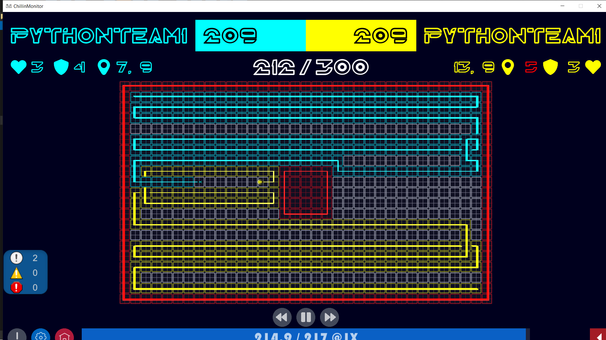
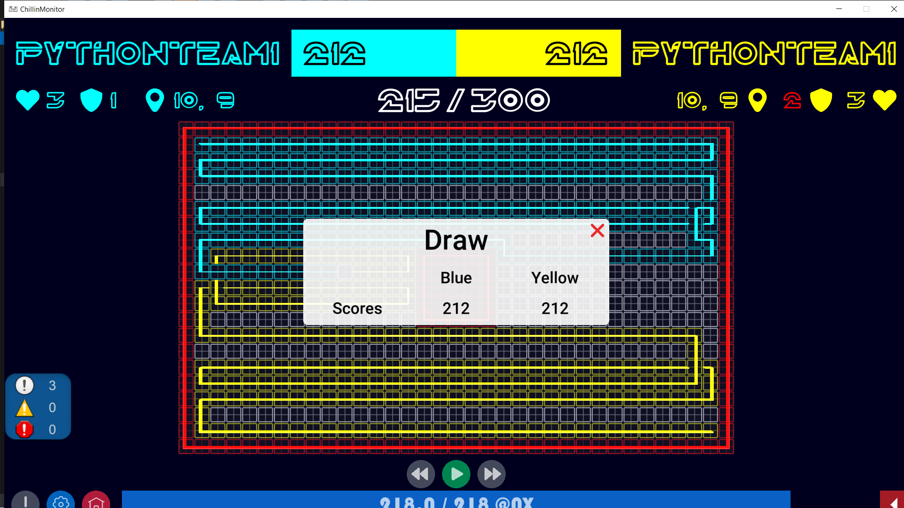

# ChillinWars-Agent

## Goal
I developed this agent for the final project of the [Artificial Intelligence course](https://github.com/SBU-CE/CE035-Artificial-Intelligence) as a **TA**. We organized the final project as a competition, similar to Chillin-Wars 2020, where students developed agents to play games and compete with. We needed agents for students to compete with, and if they could defeat these agents, we gave them a score.

## An AI-based Agent for the Tron game
Our agent for the Tron game utilizes a combination of the genetic algorithm and minimax for decision-making. Here are the key statements of our approach:

- We have a minimax tree with a fixed max depth size as a hyper-parameter.
- We have also a genetic population. our individuals represent paths in the minimax tree. 
- Define fitness for each path and then, select some individuals as parents and make the next generation by them with the mutation probability of 0.1. (as a hyper-parameter)
- Finally, we find the best path as the best individual. and the best action we choose for the next state is the first node of the best individual. (it means we analyze the fitness of the next n steps n and choose the path which gives us better fitness. And then, choosing the first action of that path as the minimax algorithm says.)

 This approach represents a combined AI-based algorithm, leveraging the power of both genetic algorithms and minimax to enhance decision-making in the Tron game.
### Here is the problem description in detail: [link](https://drive.google.com/file/d/1efJlmPG9kO5om_rzvnbNLBChglS3dRQ0/view?usp=sharing)
And here is the result on [ChillinMonitor](https://github.com/koala-team/Chillin-Monitor-2/releases/download/v2.2.1/ChillinMonitor-Linux64-v2.2.1.zip):
- both agents are using this AI-based code.

Here is the repository of the First Place in this competition: [link](https://github.com/Amirarsalan-sn/chillin-wars-2020) =))

